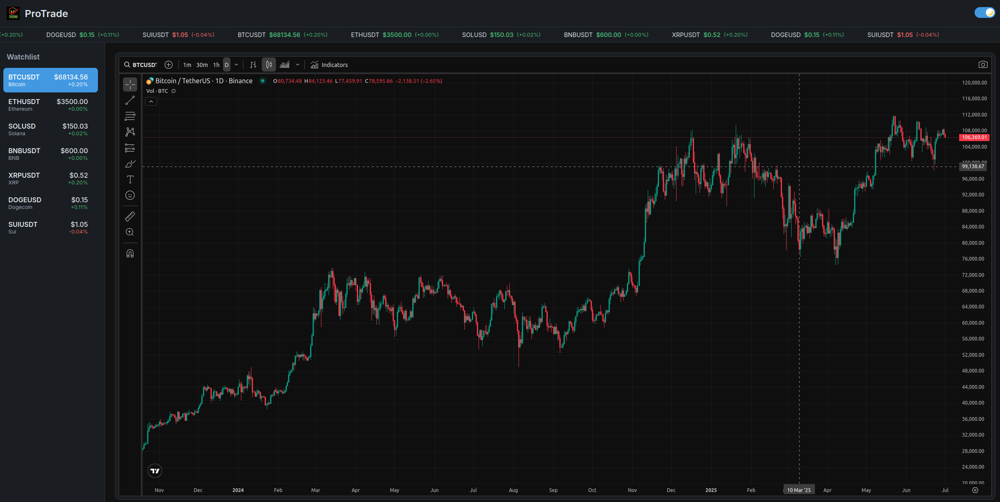

## 📈 ProTrade Dashboard

A sleek, real-time cryptocurrency trading dashboard built with ReactJS and Vite. The app simulates a live trading environment with asset watchlists, price tickers, dynamic charts, and theme toggling — all presented in a modern, responsive layout.

---

## 🚀 Features

- 📊 Real-time simulated asset price updates

💡 Dark/light theme toggle with persistence

🧭 Interactive sidebar watchlist with live price indicators

🖥️ Integrated TradingView chart for selected asset

⚛️ React context-based global state and theming

🎯 Smooth UI built with modern CSS and responsive layout

---

## 🖼️ Screenshot



---

## 🛠️ Getting Started

These instructions will help you set up and run the project on your local machine.

### 🔧 Prerequisites

- Node.js (v16 or later recommended)
- npm or yarn


---

## 📦 Installation

1. **Clone the repository**

```bash
git clone https://github.com/Brace1000/TradingApp.git
cd TradingApp
```

2. **Install dependencies**

```bash
npm install
# or
yarn install
```

3. **Start the development server**

```bash
npm run dev
# or
yarn dev
```

Then open your browser and navigate to:

```
http://localhost:5173
```

---

## 📁 Project Structure

```
protrade-dashboard/
├── public/
├── src/
│   ├── assets/
│   ├── components/
│   │   ├── Dashboard.jsx
│   │   ├── Header.jsx
│   │   ├── Sidebar.jsx
│   │   ├── RealTimeTicker.jsx
│   │   └── TradingChart.jsx
│   ├── context/
│   │   ├── AppContext.jsx
│   │   └── ThemeContext.jsx
│   ├── hooks/
│   │   └── useRealTimeData.js
│   ├── App.jsx
│   ├── main.jsx
│   └── index.css
├── .eslintrc.js
├── package.json
└── README.md
```

---

## 🧠 Technologies Used

* ReactJS(v18)
* Vite
* CSS (with backdrop filters and responsive layout)
* TradingView Widget
* JavaScript (ESModules)
* Context API for global state management
*

---

## 📜 License

This project is licensed under the MIT License - see the [LICENSE](../LICENSE) file for details.

---

## 🙌 Acknowledgements

TradingView for their charting tools

React for the front-end framework

Inspired by modern trading dashboards
---
